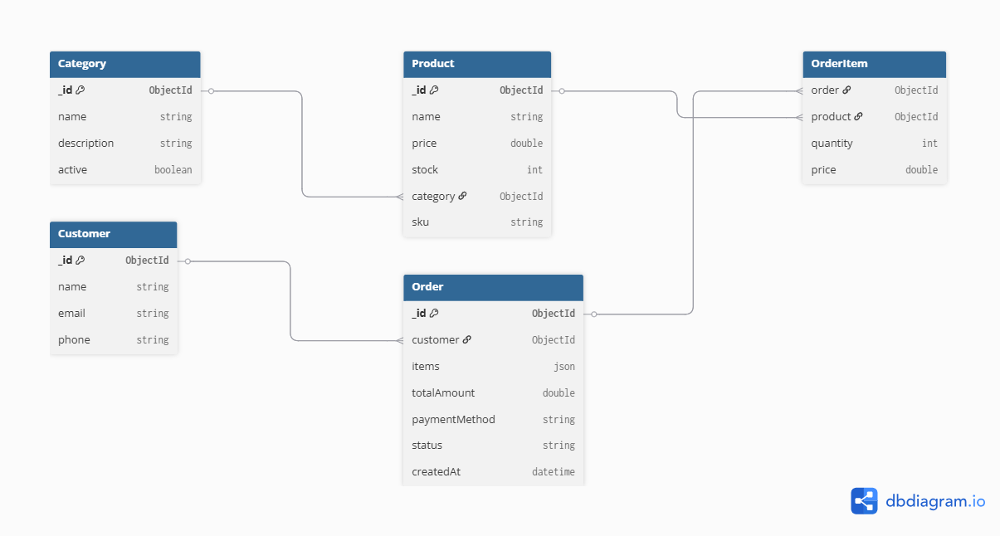

# DNCommerce

Sistema de gerenciamento de estoque e pedidos para DNCommerce.

---

## 📋 Descrição

DNCommerce é uma API RESTful desenvolvida em Node.js, Express e MongoDB para gerenciar produtos, categorias, clientes e pedidos (vendas). O sistema permite cadastro, consulta, atualização e remoção de dados, além de fornecer estatísticas de vendas e produtos.

---

## 🚀 Funcionalidades

- Cadastro, consulta, atualização e remoção de **produtos**
- Cadastro, consulta, atualização e remoção de **categorias**
- Cadastro, consulta, atualização e remoção de **clientes**
- Registro, consulta, atualização de status e cancelamento de **pedidos**
- Estatísticas de vendas, produtos mais vendidos e pedidos recentes
- API RESTful com respostas e códigos HTTP adequados

---

## 🗂️ Estrutura de Pastas

```
src/
  controllers/   # Lógica dos endpoints
  models/        # Schemas do Mongoose
  routes/        # Rotas da API
  config/        # Configuração do banco de dados
  app.js         # Arquivo principal da aplicação
docs/
  esquema-do-banco.png  # Diagrama do banco de dados
```

---

## 🛠️ Tecnologias Utilizadas

- Node.js
- Express
- MongoDB + Mongoose
- dotenv
- cors
- nodemon (dev)

---

## 🏗️ Esquema do Banco de Dados



- **Product** referencia **Category**
- **Order** referencia **Customer**
- **Order** possui vários itens, cada um referenciando um **Product**
- **Customer** pode ter vários **Order**
- **Category** pode ter vários **Product**

---

## 🔗 Endpoints Principais

### Produtos

- `GET    /api/products` — Listar produtos
- `POST   /api/products` — Cadastrar produto
- `GET    /api/products/:id` — Detalhar produto
- `PUT    /api/products/:id` — Atualizar produto
- `DELETE /api/products/:id` — Remover produto

### Categorias

- `GET    /api/categories`
- `POST   /api/categories`
- `PUT    /api/categories/:id`
- `DELETE /api/categories/:id`

### Clientes

- `GET    /api/customers`
- `POST   /api/customers`
- `GET    /api/customers/:id`
- `PUT    /api/customers/:id`
- `DELETE /api/customers/:id`

### Pedidos (Vendas)

- `GET    /api/orders`
- `POST   /api/orders`
- `GET    /api/orders/:id`
- `PATCH  /api/orders/:id/status`
- `POST   /api/orders/:id/cancel`
- `GET    /api/orders/date-range?startDate=YYYY-MM-DD&endDate=YYYY-MM-DD`
- `DELETE /api/orders/:id`

### Dashboard/Estatísticas

- `GET /api/dashboard/stats`
- `GET /api/dashboard/sales-summary`
- `GET /api/dashboard/top-products`
- `GET /api/dashboard/recent-orders`

---

## ⚙️ Como rodar o projeto

1. **Clone o repositório:**

   ```bash
   git clone https://github.com/cleiton-negreiros/RID184204_Desafio06.git
   cd RID184204_Desafio06
   ```

2. **Instale as dependências:**

   ```bash
   npm install
   ```

3. **Configure o arquivo `.env`:**

   ```
   NODE_ENV=development
   PORT=3000
   MONGODB_URI=mongodb://localhost:27017/dncommerce
   ```

4. **Inicie o MongoDB:**

   - Execute o script:
     ```bash
     start-mongodb.bat
     ```
   - Ou inicie manualmente o serviço do MongoDB.

5. **Inicie a aplicação:**

   ```bash
   npm run dev
   ```

   ou

   ```bash
   npm start
   ```

6. **Acesse a API:**
   - [http://localhost:3000](http://localhost:3000)

---

## 🧪 Testando a API

Use ferramentas como **Insomnia** ou **Postman** para testar os endpoints listados acima.

---

## 📝 Licença

Este projeto é open-source para fins educacionais.

---

## 👨‍💻 Autor

Cleiton Negreiros  
[https://github.com/cleiton-negreiros](https://github.com/cleiton-negreiros)
